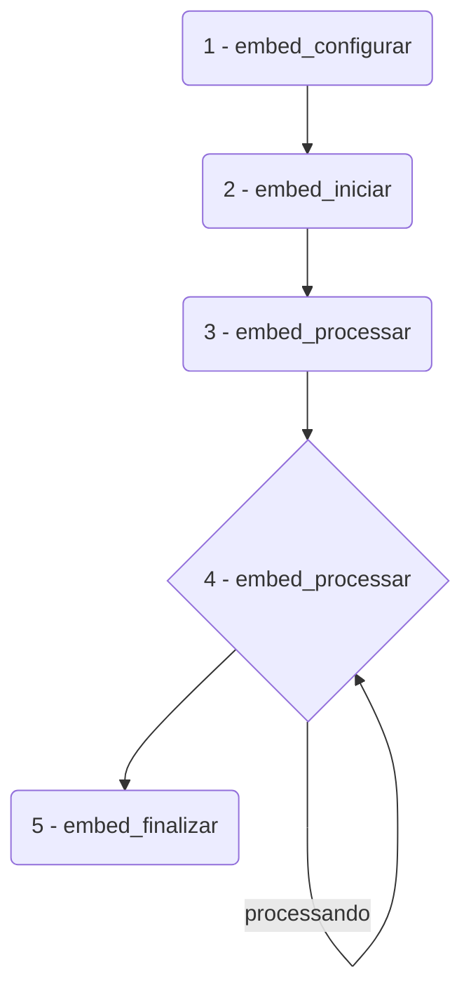
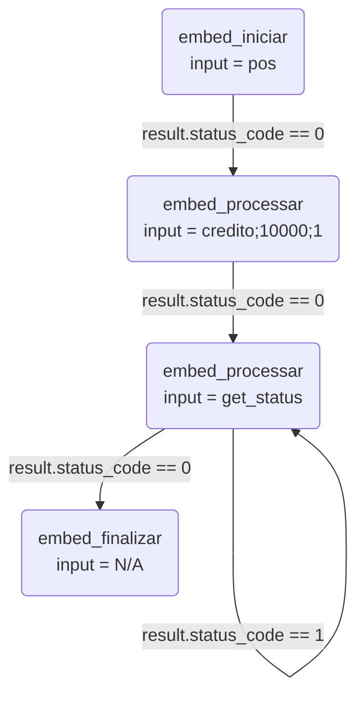
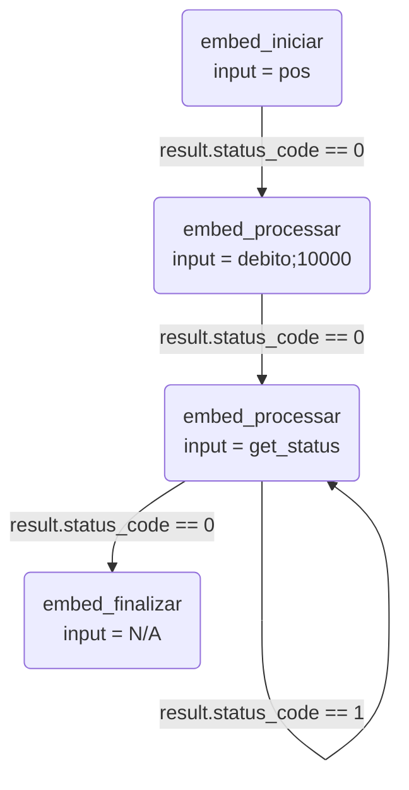

# example-lib-embed-python-pos

Exemplo demonstrativo para o uso da `lib-embed` no transações com POS.

## Instalação

### Requisitos

É necessário o Python 3 instalado em sua máquina.

Verifique a necessidade de instalar as dependências:
- PIP
- PILLOW

### Clonar

```git
git clone git@github.com:org-dev-embed/example-lib-embed-python-pos.git
```

### Configurações 

Acessar o diretório, modificar o arquivo .env.example, renomeando para .env e colocando os valores passados pelo time de integração

```
cd example-lib-embed-python-pos
mv .env.example .env
```

Feito isso, executar o programa com Python

```
python3 embed_ui.py
```

### Sobre o exemplo

Este exemplo contem três itens fundamentais:
1. embed_lib.py: carregamemento das bibliotecas 
2. embed_api.py: utilização dos métodos para transações/operações com POS
3. embed_ui.py: interface gráfica simplificada que consome os métodos

*OBS*: em **embed_ui.py** verifique as funções **processar** de cada item, ali tem o caminho das pedras para integração

## API

### Fluxos
Vamos definir o fluxo que deve ser seguido para que sua implementação seja realizada seguindo as melhores práticas no uso da nossa API

#### Geral


#### Transações

1. Crédito

2. Débito


### Métodos

#### 1. Configurar 

Este método realiza a configuração do produto, para este caso POS

##### 1.1. Assinatura

```c++
char* embed_configurar(char* input);
```

##### 1.2. Parâmetros

Aqui estão as definições para _input_ e _output_ para este método

###### 1.2.1. Input

Pode ser parametrizado de duas maneiras:

1. JSON
```json
{
    "configs": {
        "produto": "pos",                                        
        "sub_produto": "1",                                       
        "infos": {
            "token": "",                      // gerado pelo time de integração
            "username": "",                   // gerado pelo time de integração
            "password": "",                   // gerado pelo time de integração
            "pos_numero_serial_padrao": ""    // gerado pelo time de integração
        }
    }
}
```
2. Metaparâmetro (obedecendo a sequência)
```c
"pos;1;token;username;password;pos_numero_serial_padrao"
```

###### 1.2.2. Output

O retorno para este método consiste em um Json (sempre), no seguinte formato:

```json
{
  "codigo": 0,
  "mensagem": "Sucesso"
}
```

#### 2. Iniciar

Este método realiza a inicialização do produto, para este caso POS

##### 2.1. Assinatura

```c++
char* embed_iniciar(char* input);
```

##### 2.2. Parâmetros

Aqui estão as definições para _input_ e _output_ para este método.

###### 2.2.1. Input

Pode ser parametrizado de duas maneiras:

1. JSON
```json
{
    "iniciar": {
        "operacao": "pos"
    }
}
```
2. Metaparâmetro
```c
"pos"
```

###### 2.2.2. Output

O retorno para este método consiste em um JSON (sempre), no seguinte formato:

```json
{
    "codigo": 0,
    "mensagem": "Sucesso",
}
```

#### 3. Processar

Este método realiza o processamento de transações POS

##### 3.1. Assinatura

```c++
char* embed_processar(char* input);
```

##### 3.2. Parâmetros

Aqui estão as definições para _input_ e _output_ para este método.

###### 3.2.1. Input

Temos cinco modalidades de processamento que podem ser realizadas:
1. crédito
2. débito
5. get_status (transação atual)

Estas modalidades podem ser parametrizadas de duas formas:

1. JSON
```json
// Crédito
{
    "processar": {
        "operacao": "credito",          // credito 
        "valor": "",                    // em centavos (se R$ 1,00 logo 100)
        "parcelas": "",                 // 1 a 99 (se a vista logo 1)
    }
}
// Débito
{
    "processar": {
        "operacao": "debito",           // debito
        "valor": ""                     // em centavos (se R$ 1,00 logo 100)
    }
}
// Get Status
{
    "processar": {
        "operacao": "get_status"
    }
}
```
2. Metaparâmetro (obedecendo a sequência)
```c
// Crédito
"credito;valor;parcelas"
// Débito
"debito;valor"
// Get Status
"get_status"
```
###### 3.2.2. Output

O retorno para este método consiste em um JSON (sempre), no seguinte formato:

```json
{
    "codigo": 0,
    "mensagem": "Sucesso",
    "resultado": {
        "status_code": 1,
        "status_message": "iniciado"
    }
}
```

#### 4. Finalizar

Este método realiza a finalização de transações TEF

##### 4.1. Assinatura

```c++
char* embed_finalizar(char* input);
```

##### 4.2. Parâmetros

Aqui estão as definições para os _inputs_ e _output_ para este método.

###### 4.2.1. Input

Pode ser parametrizado de duas maneiras:

1. JSON
```json
{
    "finalizar": {
        "operacao": "",
    }
}
```
2. Metaparâmetro
```c
""
```

###### 4.2.2. Output

O retorno para este método consiste em um JSON (sempre), no seguinte formato:

```json
{
    "codigo": 0,
    "mensagem": "Sucesso",
    "resultado": {
        "status_code": 1,
        "status_message": "iniciado"
    }
}
```

#### 5. Obter Valor

Este método responsável por buscar um valor contido em uma chave ou objeto de um JSON válido. 

##### 5.1. Assinatura

```c++
char* embed_obter_valor(char* json, char* key);
```

##### 5.2. Parâmetros

Aqui estão as definições para os _inputs_ e _output_ para este método.

###### 5.2.1. Input

Deve ser informado sempre um String com conteúdo JSON.

```json
// Json
{
    "key1": "value1",
    "key2": {
        "key21": "value21",
        "key22": "value22",
        "key23": "value23",
        "key24": "value24",
        "key25": "value25"
    }
}
```
```c
// Key
"key2.key25"
```

###### 5.2.2. Output

Será um String com valor informado em _key_ se conter em _json_ 

```c
// Value
"value25"
```

### Retornos 

Os possíveis retornos para os métodos utilizando o produto TEF conforme as tabelas abaixo

| codigo | mensagem |
| - | - |
| 0 | Sucesso | 
| -1 | Erro |
| -2 | Deserialize |
| -3 | ProviderError |
| -21 | TefError |
| -22 | TefMissingParameter |
| -23 | TefInvalidOperation |
| -24 | TefInputBadFormat |
| -25 | TefTransactionError |

| status_code | status_message |
| - | - |
| -1 | erro |
| 0 | finalizado |
| 1 | processando |

### Dados da Transação

Ao finalizar com sucesso a propriedade _result_ além de retornar _status_code_ e _status_message_, contém outros dados da transação conforme a tabela abaixo

| Chave | Descrição |
| - | - |
| tipo_cartao | Modalidade de pagamento (débito ou crédito) |
| valor | Valor do pagamento realizado em centavos |
| parcelas | Quantidade de parcelas (para débito sempre o valor será 1) |
| data_hora | Data/hora do pagamento realizado|
| rede | Rede que realizou o pagamento |
| bandeira | Bandeira do cartão que realizou o pagamento |
| nsu | Número sequencial único (utilizado para realizar o cancelamento) |
| codigo_autorizacao | Código da autorização do pagamento |
